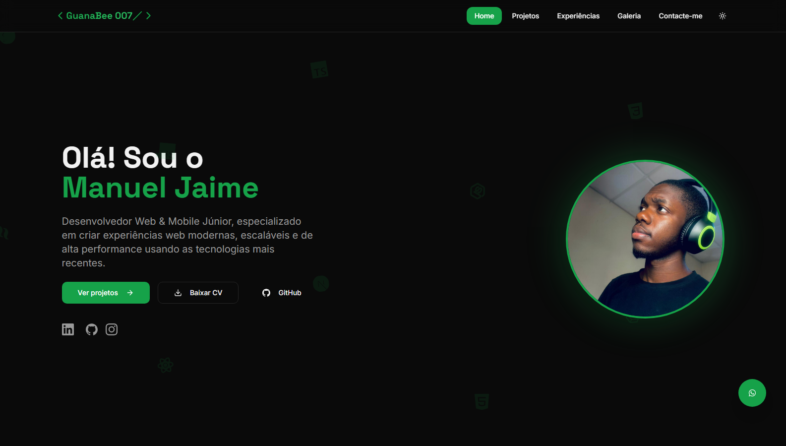

# Meu Portfólio Web Profissional

> Aplicação full stack moderna desenvolvida com tecnologias de ponta para demonstrar minhas habilidades em **Frontend, Backend e Arquitetura de Software**.




---

<!-- 🔗 [Acessar o projeto](https://teu-link.vercel.app) -->


## Tecnologias Principais

### Backend – **NestJS + Prisma**

- **NestJS (v11)** — Framework robusto para Node.js com arquitetura modular e suporte a TypeScript.
- **Prisma ORM (v6)** — Mapeamento de dados eficiente e tipado para PostgreSQL.
- **PostgreSQL** — Banco de dados relacional de alta performance.
- **Zod + Class Validator** — Validação segura e escalável de dados.
- **bcrypt** — Hashing de senhas com segurança de nível profissional.
- **Swagger** — Documentação automática e interativa da API.

### Frontend – **React + Tailwind + Radix UI**

- **React 18** — Interface dinâmica e declarativa.
- **Tailwind CSS 3** — Estilização rápida e responsiva com utilitários prontos.
- **Radix UI + Framer Motion** — Componentes acessíveis com animações fluidas.
- **TanStack Query** — Controle inteligente de estado e requisições assíncronas.
- **React Hook Form + Zod** — Formulários reativos com validação forte.
- **Lucide React* — Ícones e modernos e leves.
<!-- - **Lucide React & Recharts** — Ícones e gráficos modernos e leves. -->

### Ferramentas de Desenvolvimento

- **TypeScript 5.9** — Tipagem avançada para maior confiabilidade do código.
- **Vite** — Build ultra rápido e otimizado para produção.
- **ESLint + Prettier** — Padronização e qualidade de código.
- **Jest + Supertest** — Testes automatizados de integração e unidade.

---

## Funcionalidades

-  Páginas web responsivas.
-  Autenticação e autorização com JWT e bcrypt.
-  CRUD completo com validação e tratamento de erros.
-  Modo claro/escuro dinâmico.
-  API documentada com Swagger.
<!-- -  Dashboard interativo e responsivo. -->

---

## Estrutura do Projeto

```
├── project/
│ ├── api/ 
│ └── docs/ 
│ └── frontend/
└── README.md
```

## Aprendizados e Objetivo

Esse projeto foi criado com o propósito de:

- Consolidar meus conhecimentos em **desenvolvimento web full stack**;
- Demonstrar minha capacidade de **criar, organizar e documentar** sistemas complexos;
- Servir como **base profissional** para projetos futuros e contribuições open-source.

---

## Deploy

- **Frontend:** hospedado na [Vercel](https://vercel.com)
- **Backend:** construído em **NestJS**, pronto para escalar em qualquer ambiente.

---

## Autor

**Manuel Jaime**  
Desenvolvedor Web | Frontend & Backend  
📧 manueljaime0020@gmail.com _(manueljaime0020@gmail.com)_  
🌐 [LinkedIn](https://www.linkedin.com/in/manuel-jaime-816a8536b/) · [GitHub]("https://github.com/manueljaime007")

---


<!--  -->
<!--  -->


<!-- --- -->

