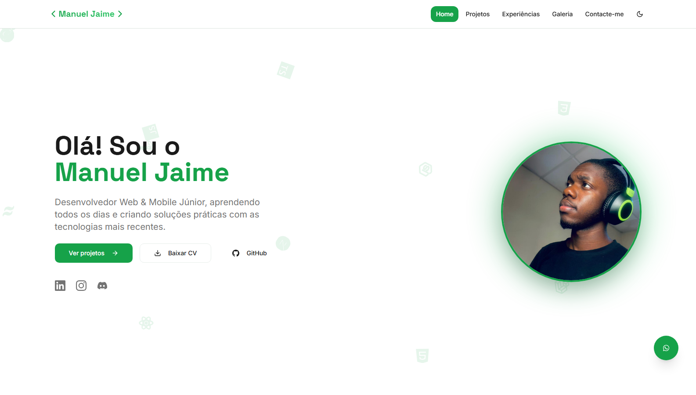
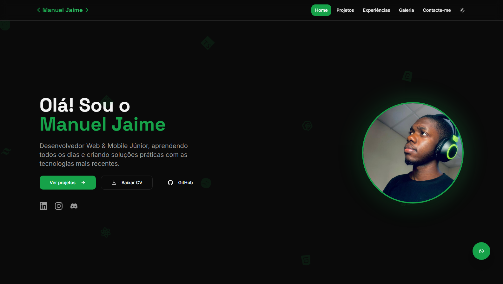

# My Professional Web Portfolio


> A modern full-stack application built with cutting-edge technologies to showcase my skills in **Frontend, Backend, and Software Architecture**.

<!-- 🔗 [Visit website](https://teu-link.vercel.app) -->



**Dark Mode**



## Main Technologies

### Backend – **NestJS + Prisma**

- **NestJS (v11)** — A robust Node.js framework with modular architecture and full TypeScript support.
- **Prisma ORM (v6)** — Efficient and type-safe data mapping for PostgreSQL.
- **PostgreSQL** — High-performance relational database.
- **Zod + Class Validator** — Secure and scalable data validation.
- **Swagger** — Automatic and interactive API documentation.

### Frontend – **React + Tailwind + Radix UI**

- **React 18** — Dynamic and declarative user interfaces.
- **Tailwind CSS 3** — Fast and responsive styling with utility-first classes.
- **Radix UI + Framer Motion** — Accessible components with smooth animations.
- **TanStack Query** — Smart state and async data management.
- **Lucide React** — Modern and lightweight icon set.

### Development Tools

- **TypeScript 5.9** — Advanced typing for reliable and maintainable code.
- **Vite** — Ultra-fast build tool optimized for production.
- **ESLint + Prettier** — Code quality and formatting consistency.
- **Jest + Supertest** — Automated unit and integration testing.

---

## Features

- Fully responsive web pages.
- Authentication and authorization with JWT and bcrypt.
- Complete CRUD operations with validation and error handling.
- Dynamic light/dark mode.
- API documented with Swagger.
<!-- -  Interactive and responsive dashboard. -->

---

## Project Structure

```
├── project/
│ ├── api/
│ └── docs/
│ └── frontend/
└── README.md
```

## Learning Goals and Purpose

This project was created to:

- Strengthen my knowledge in **full-stack web development**;
- Demonstrate my ability to **build, organize, and document** complex systems;
- Serve as a **professional foundation** for future projects and open-source contributions.

---

## Deployment

- **Frontend:** hosted on [Vercel](https://vercel.com)
- **Backend:** built with **NestJS**, ready to scale in any environment.

---

## Author

**Manuel Jaime**  
Web Developer | Frontend & Backend  
📧 manueljaime0020@gmail.com _(manueljaime0020@gmail.com)_  
🌐 [LinkedIn](https://www.linkedin.com/in/manuel-jaime-816a8536b/) 
<!-- · [GitHub]("https://github.com/manueljaime007") -->

---
